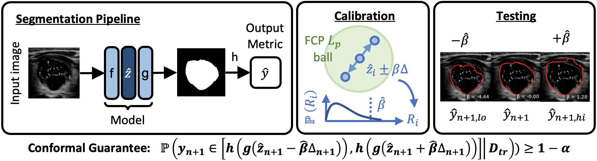

# COMPASS: Robust Feature Conformal Prediction for Medical Segmentation Metrics

This repository contains the **COMPASS 2D** code for conformal prediction on **segmentation-derived scalar metrics**.

## Overview



## Citation

If you use COMPASS in your research, please cite:

```bibtex
@article{cheung2025compass,
  title={COMPASS: Robust Feature Conformal Prediction for Medical Segmentation Metrics},
  author={Cheung, Matt Y and Veeraraghavan, Ashok and Balakrishnan, Guha},
  journal={arXiv preprint arXiv:2509.22240},
  year={2025}
}
```

## Quickstart (2D)

1) Install:

```bash
pip install -r requirements-2d.txt
```

2) Prepare dataset folders and train models:

- preprocessing + training helpers: `2D/datasets/<dataset>/`
- baseline training: `python 2D/datasets/<dataset>/run_nn.py`
- 3-head QR/CQR training: `python 2D/datasets/<dataset>/run_qrnn.py`

3) Run COMPASS:

- recommended (logits-only): `python 2D/run_cp_L.py`
- full (includes Jacobians): `python 2D/run_cp.py`

See `2D/README.md` for step-by-step details.

## Results

Outputs are written under `COMPASS_RESULTS_DIR` (default: `/scratch/yc130/compass_results`).

This release intentionally does **not** include figure-generation / plotting scripts.
